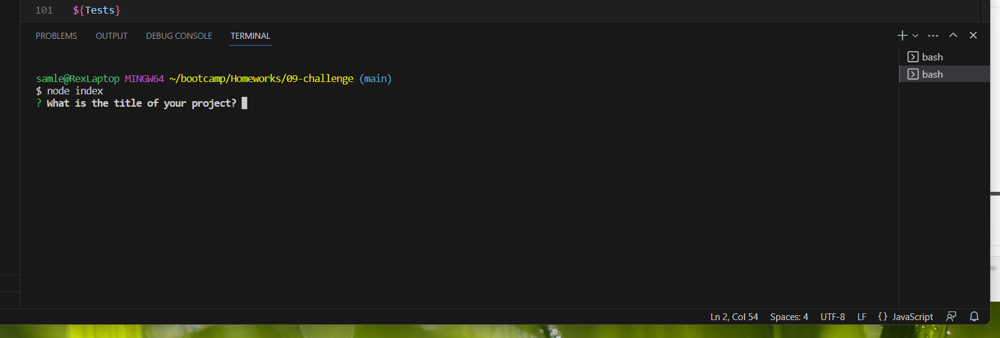
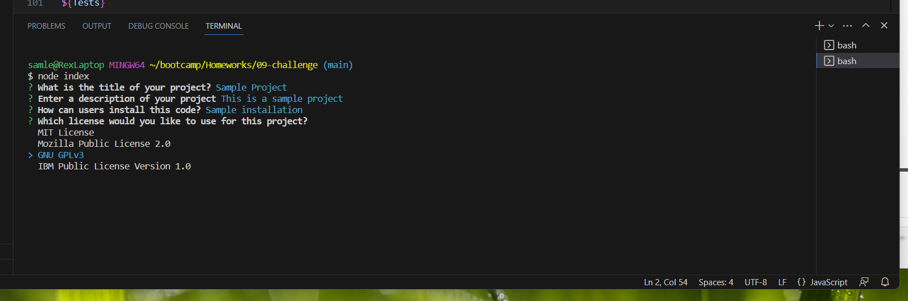
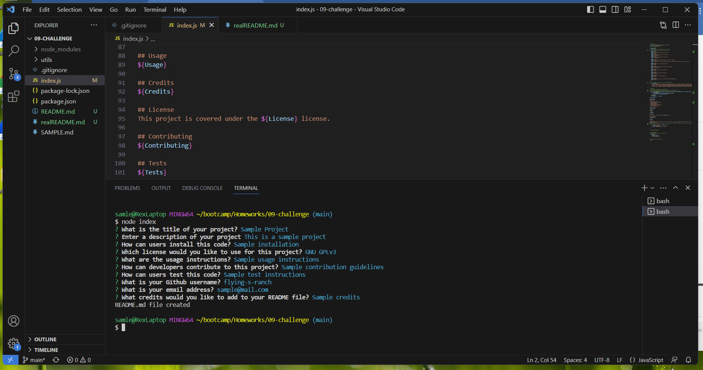
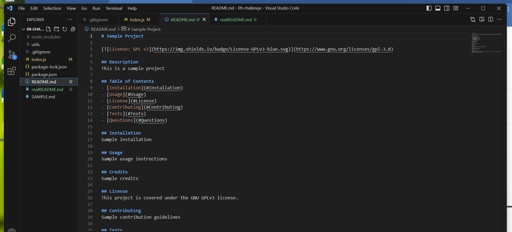

# README Generator

    
## Description
This project uses node js to produce high-quality README files. This project gave me the opportunity to practice using node and two of its tools: Inquirer and 'fs'(file system). I enjoyed using Inquirer and getting responses to questions, especially list type for the License options.
    
## Table of Contents
- [Installation](#Installation)
- [Usage](#Usage)
- [License](#License)
- [Contributing](#Contributing)
- [Tests](#Tests)
- [Questions](#Questions)
    
## Installation
To use this code, make sure you have node installed on your computer. You can go to https://nodejs.org/en/download to get started if you do not have node installed
    
## Usage
Open the terminal for the program and enter 'node index'. Questions will appear in the terminal. Answer these in order to fill out the content  of your README file. At the end of the questions, a README.md file will be generated along with a confirmation in the console log. This video shows the steps to generate a README: https://drive.google.com/file/d/1Hf9twjub2mBX5MNj4aS2IXn07lOa5DQo/view?usp=drive_link 

This screenshot shows what will appear after entering 'node index'. Make sure that the terminal is open in the correct file: 

When you reach the license list, use the arrow key to select your preferred license, then press the enter key:

After the last question, the console will log that a README.md file has been created. Look on the lefthand side to verify that there is a new README.md file:

Finally, you can open the new file to see the responses that you entered in the terminal:

## Credits
The mini-project for module 9 was very helpful in understanding the steps needed for this project. In class we generated an HTML file, and many of the steps translated directly into this project, including how to make use of a backtick section, how to access answers from an inquirer prompt and how to place the answers within the created file correctly. 

JS Lines 10-50, 119-121: I used the npmjs documentation for how to structure a question using Inquirer, specifically the basic structure and the structure of 'list' type (line 24). The link for this documetation is: https://www.npmjs.com/package//inquirer#question 

JS Lines 24, 54-57: I accessed the license badge information from a GitHub page titled 'Markdown License badges', available here: https://gist.github.com/lukas-h/2a5d00690736b4c3a7ba. I also used a list titled 'Licenses' found here: https://choosealicense.com/licenses/ 

JS Lines 78-83: I learned how to create links within a markdown file from a GitHub docs page with this link: https://docs.github.com/en/get-started/writing-on-github/getting-started-with-writing-and-formatting-on-github/basic-writing-and-formatting-syntax#section-links

JS Line 104: A W3 Schools example helped me understand how to include an email within a link. I used the following link: https://www.w3schools.com/tags/tryit.asp?filename=tryhtml_link_mailto

JS Line 106-109: I used the node js documentation to write the fs.writeFile function, available here: https://nodejs.org/api/fs.html#fswritefilefile-data-options-callback.
    
## License
This project is covered under the MIT License.

MIT License

Copyright (c) 2023 Samantha Shrauner

Permission is hereby granted, free of charge, to any person obtaining a copy
of this software and associated documentation files (the "Software"), to deal
in the Software without restriction, including without limitation the rights
to use, copy, modify, merge, publish, distribute, sublicense, and/or sell
copies of the Software, and to permit persons to whom the Software is
furnished to do so, subject to the following conditions:

The above copyright notice and this permission notice shall be included in all
copies or substantial portions of the Software.

THE SOFTWARE IS PROVIDED "AS IS", WITHOUT WARRANTY OF ANY KIND, EXPRESS OR
IMPLIED, INCLUDING BUT NOT LIMITED TO THE WARRANTIES OF MERCHANTABILITY,
FITNESS FOR A PARTICULAR PURPOSE AND NONINFRINGEMENT. IN NO EVENT SHALL THE
AUTHORS OR COPYRIGHT HOLDERS BE LIABLE FOR ANY CLAIM, DAMAGES OR OTHER
LIABILITY, WHETHER IN AN ACTION OF CONTRACT, TORT OR OTHERWISE, ARISING FROM,
OUT OF OR IN CONNECTION WITH THE SOFTWARE OR THE USE OR OTHER DEALINGS IN THE
SOFTWARE.

## Questions
To get in touch with any questions, visit my <a href="https://github.com/flying-s-ranch"> Github Profile </a> or send an <a href="mailto:samleashrauner@gmail.com">email</a>